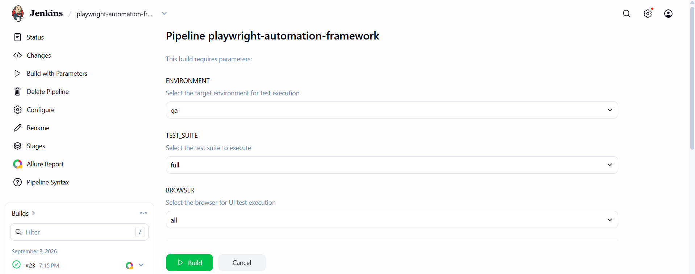
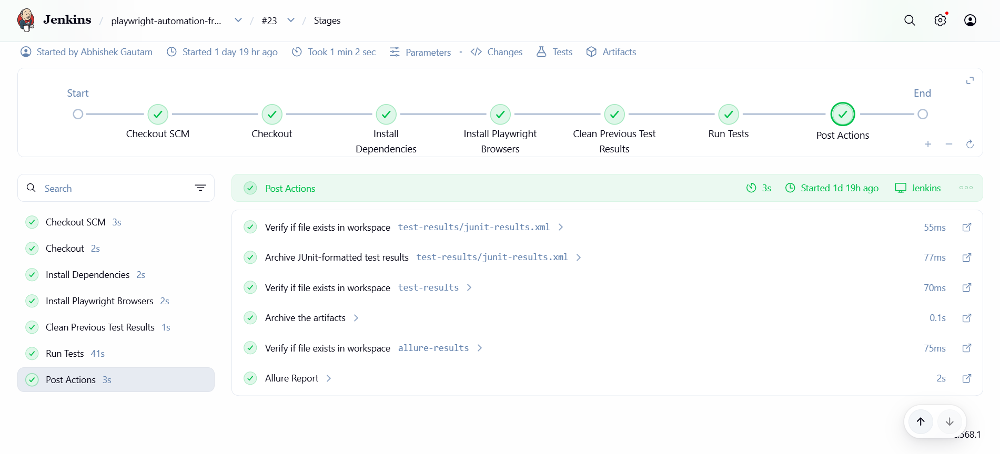
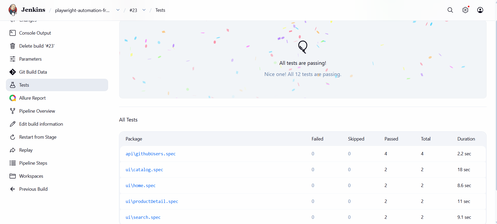
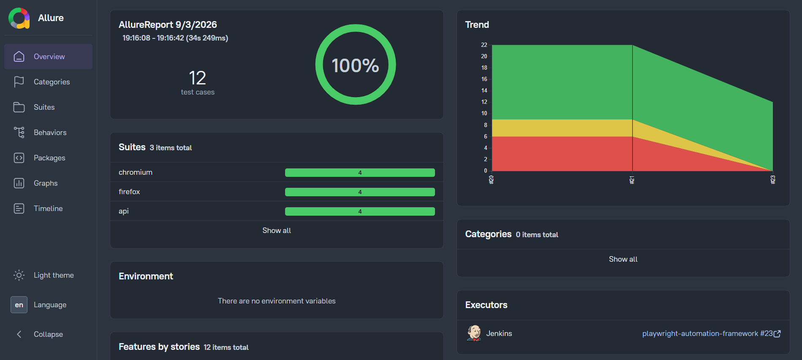

# Playwright Enterprise Framework

An enterprise-oriented end-to-end test automation framework built using **Playwright and TypeScript**.

The framework supports **UI and API automation, multi-environment execution, cross-browser testing, smoke and regression suites, reusable fixtures, Page Object Model, API client abstraction, Jenkins CI/CD execution, JUnit reporting, Allure reporting, and failure artifacts**.

The project is designed to demonstrate how an automation framework can be structured and executed in a CI environment rather than focusing only on individual automated test scripts.

---

## 📌 Overview

This project demonstrates an enterprise-oriented Playwright automation framework designed to support:

- UI automation
- API automation
- Cross-browser testing
- Environment-based execution
- Smoke and regression suites
- Known issue exclusion
- Reusable fixtures
- Page Object Model
- API client abstraction
- Static and dynamic test data
- Jenkins CI/CD execution
- JUnit reporting
- Allure reporting
- Screenshots, videos, and traces for failed tests

The framework separates test logic from page interactions, API communication, environment configuration, and test data.

---

# 🎯 Why This Project?

This project was built to demonstrate a structured and scalable approach to test automation using Playwright and TypeScript.

Rather than creating individual automated test scripts, the framework focuses on separating responsibilities across reusable layers such as:

- Test cases
- Custom Playwright fixtures
- Page Objects
- Reusable UI components
- API clients
- API models
- Environment management
- Test data management
- CI/CD execution

The project also demonstrates practical automation engineering concepts including:

- Multi-environment execution
- Cross-browser testing
- Test tagging
- Known issue exclusion
- CI-specific retries
- Parallel execution
- Parameterized Jenkins pipelines
- JUnit reporting
- Allure reporting
- Failure screenshots, videos, and traces

The goal of the project is to provide a foundation that can be extended as the application, test suite, and CI infrastructure grow.

---

# 🚀 Key Features

- Playwright with TypeScript
- UI automation using Page Object Model
- Reusable UI components
- API automation using Playwright APIRequestContext
- API client abstraction layer
- Typed API response models
- Custom Playwright fixtures
- Environment management for QA, DEV, and PROD
- Static and factory-based test data
- Smoke and regression test tagging
- Known issue exclusion from CI execution
- Cross-browser execution
- CI-specific retries and worker configuration
- Parameterized Jenkins pipeline
- JUnit XML reporting
- Allure reporting
- Screenshots for failed tests
- Videos for failed tests
- Traces for failed tests
- Automatic cleanup of stale CI results before execution

---

# 🛠 Technology Stack

| Category | Technology |
|---|---|
| Language | TypeScript |
| Test Framework | Playwright |
| UI Automation | Playwright |
| API Automation | Playwright APIRequestContext |
| CI/CD | Jenkins |
| Test Reporting | JUnit XML |
| Advanced Reporting | Allure |
| Environment Management | dotenv |
| Cross-platform Environment Variables | cross-env |
| Test Data Generation | Faker |
| Package Manager | npm |

---

# ⭐ Project Highlights

This project demonstrates practical automation framework engineering beyond individual Playwright test scripts.

### Key Areas Demonstrated

- Layered automation framework architecture
- Page Object Model (POM)
- Reusable UI components
- Custom Playwright fixtures
- Browser and environment abstraction
- API request fixture and API client abstraction
- Typed API response models
- API chaining
- Static and dynamic test data management
- Environment-based test execution
- Smoke, regression, and known-issue test organization
- Cross-browser testing
- CI-specific Playwright configuration
- Parameterized Jenkins CI/CD pipeline
- Dynamic Playwright command generation
- CI execution matrix
- JUnit and Allure reporting
- Playwright HTML reporting
- Failure artifact retention
- CI workspace and result cleanup

---

# ⚡ Quick Start

## Prerequisites

Make sure the following are installed:

- Node.js
- npm
- Playwright-supported browser dependencies
- Git

## Clone the Repository

Clone the repository locally:

```bash
git clone https://github.com/QA-abhi3011/playwright-automation-framework.git
```

Navigate to the project directory:

```bash
cd playwright-automation-framework
```

## Install Dependencies

```bash
npm install
```

## Install Playwright Browsers

```bash
npx playwright install
```

## Run the Test Suite

```bash
npm test
```

## Run Tests in a Specific Environment

### QA

```bash
npm run test:qa
```

### DEV

```bash
npm run test:dev
```

### PROD

```bash
npm run test:prod
```

---

# 🏗️ Framework Architecture

The framework follows a layered architecture.

```text
                         TEST LAYER
                              │
              ┌───────────────┴───────────────┐
              │                               │
           UI TESTS                        API TESTS
              │                               │
              ▼                               ▼
       Custom UI Fixture                  API Fixture
              │                               │
              ▼                               ▼
       BrowserManager                 APIRequestContext
              │                               │
              ▼                               ▼
         Page Objects                    API Clients
              │                               │
              ▼                               ▼
   Reusable Components                  API Models
              │
              ▼
        Playwright Page


                 SUPPORTING FRAMEWORK LAYERS

                              │
                    EnvironmentManager
                              │
                       QA / DEV / PROD
                              │
              ┌───────────────┴───────────────┐
              │                               │
              ▼                               ▼
        Static Test Data                  Data Factories
              │                               │
              └───────────────┬───────────────┘
                              │
                              ▼
                        Test Execution
                              │
                              ▼
                     Playwright Configuration
                              │
                              ▼
                        Jenkins Pipeline
                              │
                              ▼
                    JUnit / Allure Reports
```

---

# 🧠 Framework Design Decisions

## Why Page Object Model?

Page Objects separate UI interaction logic from test cases.

This improves:

- Reusability
- Maintainability
- Readability
- Selector management

## Why Custom Fixtures?

Custom Playwright fixtures provide reusable framework-level objects to tests.

The framework uses fixtures to provide:

- Browser management
- API request contexts

This prevents repeated setup and initialization logic inside individual tests.

## Why API Client Classes?

API communication is separated from test logic through API client classes.

Tests focus on validating business behavior, while API clients handle:

- Request construction
- Endpoint interaction
- API communication

This keeps API tests concise and easier to maintain.

## Why Environment Manager?

The Environment Manager centralizes environment-specific configuration.

The same test suite can run against different environments without modifying test code.

```text
Same Test Suite
       │
       ▼
Environment Selection
       │
 ┌─────┼─────┐
 ▼     ▼     ▼
QA    DEV   PROD
```

---

## Why Jenkins Parameters?

A single parameterized Jenkins pipeline is used instead of maintaining separate pipelines for different execution scenarios.

The pipeline allows users to select:

- Environment
- Test Suite
- Browser

The selected parameters are then used to dynamically construct the Playwright execution command.

```text
Jenkins Parameters
       │
       ├── Environment
       ├── Test Suite
       └── Browser
              │
              ▼
     Dynamic Test Command
              │
              ▼
      Playwright Execution
```

---

# 📁 Project Structure

```text
playwright-automation-framework/
│
├── config/
│   └── env/
│       ├── .env.qa
│       ├── .env.dev
│       └── .env.prod
│
├── src/
│   │
│   ├── api/
│   │   ├── clients/
|   |       └── GitHubApiClient.ts
│   │   └── models/
|   |       └── GitHubUserModels.ts
│   │
│   ├── components/
│   │   └── NavigationComponent.ts
│   │
│   ├── core/
│   │   ├── BrowserManager.ts
│   │   └── EnvironmentManager.ts
│   │
│   ├── data/
│   │   ├── factories/
│   │   │   ├── apiSearchDataFactory.ts
│   │   │   └── SearcDataFactory.ts
│   │   │
│   │   ├── static/
│   │   │   └── productData.ts
│   │   │
│   │   └── types/
│   │       └── Product.ts
│   │
│   ├── fixtures/
│   │   ├── apiFixture.ts
│   │   └── testFixtures.ts
│   │
│   └── pages/
│       ├── CartPage.ts
│       ├── CatalogPage.ts
│       ├── HomePage.ts
│       ├── ProductDetailsPage.ts
│       └── SearchPage.ts
│
├── tests/
│   ├── api/
│   │   └── githubUsers.spec.ts
│   │
│   └── ui/
│       ├── cart.spec.ts
│       ├── catalog.spec.ts
│       ├── home.spec.ts
│       ├── productDetail.spec.ts
│       └── search.spec.ts
│
├── Jenkinsfile
├── playwright.config.ts
├── package.json
├── .gitignore
└── README.md
```

---

# 🔍 Architecture Breakdown

## UI Automation Architecture

UI tests use the Page Object Model (POM) to separate test logic from UI interactions.

```text
Test
 │
 ▼
BrowserManager
 │
 ▼
Page Object / Reusable Component
 │
 ▼
Playwright Page
 │
 ▼
Application Under Test

```

A typical UI test can use multiple framework layers:

```text
Test
│
├── BrowserManager
│
├── EnvironmentManager
│
├── NavigationComponent
│
├── HomePage
│
├── CatalogPage
│
├── ProductDetailsPage
│
└── Static Test Data
```

## 🔌 API Automation Architecture

API tests use Playwright's APIRequestContext through a custom API fixture.

```text
API Test
   │
   ▼
API Fixture
   │
   ▼
APIRequestContext
   │
   ▼
API Client
   │
   ▼
Target API
```
The API request context receives its base URL from the selected environment.

```text
Selected Environment
        │
        ▼
EnvironmentManager
        │
        ▼
API Base URL
        │
        ▼
APIRequestContext
```

---

# 🌍 Environment Management

The framework supports three environments:

QA
DEV
PROD

Environment files are stored under:

```text
config/
└── env/
    ├── .env.qa
    ├── .env.dev
    └── .env.prod
```

The environment is selected using the ENV variable.

ENV=qa
   │
   ▼
.env.qa


ENV=dev
   │
   ▼
.env.dev


ENV=prod
   │
   ▼
.env.prod

The EnvironmentManager is responsible for:

Determining the selected environment
Loading the appropriate environment file
Providing the UI Base URL
Providing the API Base URL

If no environment is provided, the framework defaults to:

qa

---

# 📊 Test Data Management

Test data is separated from test logic to improve maintainability, reusability, and readability.

## Static Test Data

Static test data is stored under:

```text
src/data/static/
```

This is useful for predictable and reusable test scenarios.

Examples include:

- Product data
- Search data
- Test constants

## Dynamic Test Data

Dynamic test data is generated through factory classes.

```text
src/data/factories/
```

Factories prevent unnecessary hardcoding inside test cases and support dynamic test execution.

The framework also uses Faker to generate dynamic test data, such as unique or non-existing search values for API test scenarios.

---

# 🏷️ Test Tagging Strategy

The framework uses Playwright tags to organize and control test execution.

## Smoke Tests

Smoke tests are tagged with:

```text
@smoke
```

Run smoke tests using:

```bash
npm run test:smoke
```

## Regression Tests

Regression tests are tagged with:

```text
@regression
```

Run regression tests using:

```bash
npm run test:regression
```

## Known Issues

Tests associated with known issues can be tagged with:

```text
@knownIssue
```

CI execution can exclude known issue tests using:

```bash
--grep-invert @knownIssue
```

Known issue tests can still be executed separately:

```bash
npm run test:known-issues
```

### Example

Tests can contain multiple tags depending on the test coverage:

```ts
test('@smoke @regression Verify Product Details', async ({ browserManager }) => {
  // Test implementation
});
```

This tagging strategy allows the framework to:

- Execute smoke tests independently
- Execute regression tests independently
- Exclude known issue tests from CI execution
- Run known issue tests separately when required
- Apply multiple tags to a single test

---

# 🧪 Test Execution Commands

| Test Type | Command |
|---|---|
| Run UI Tests | `npm run test:ui` |
| Run API Tests | `npm run test:api` |
| Run Smoke Tests | `npm run test:smoke` |
| Run Regression Tests | `npm run test:regression` |
| Run UI Smoke Tests | `npm run test:ui:smoke` |
| Run UI Regression Tests | `npm run test:ui:regression` |
| Run API Smoke Tests | `npm run test:api:smoke` |
| Run API Regression Tests | `npm run test:api:regression` |
| Run Tests in Headed Mode | `npm run test:headed` |

---

# 🚀 CI Test Execution Commands

The CI test commands are designed for Jenkins execution and automatically exclude tests tagged with `@knownIssue`.

| CI Suite | Command | Description |
|---|---|---|
| Complete CI Suite | `npm run test:ci` | Runs Chromium, Firefox, and API tests |
| Smoke CI Suite | `npm run test:ci:smoke` | Runs smoke tests across configured CI projects |
| Regression CI Suite | `npm run test:ci:regression` | Runs regression tests across configured CI projects |
| UI CI Suite | `npm run test:ci:ui` | Runs UI tests on Chromium and Firefox |
| API CI Suite | `npm run test:ci:api` | Runs API tests only |

> **Note:** CI commands exclude tests tagged with `@knownIssue` using Playwright's `--grep-invert @knownIssue` filter.

---

# 🔄 Environment-Specific CI Execution

The framework provides dedicated CI commands for executing the test suite against a specific environment.

| Environment | Command |
|---|---|
| QA | `npm run test:ci:qa` |
| DEV | `npm run test:ci:dev` |
| PROD | `npm run test:ci:prod` |

---

# 💡 CI-Specific Playwright Configuration

The framework applies different execution settings when running in CI compared with local execution.

| Configuration | Local Execution | CI Execution |
|---|---|---|
| Parallel Execution | `fullyParallel: true` | `fullyParallel: true` |
| Retries | `0` | `2` |
| Workers | Playwright default | `2` |
| Headless Mode | `true` | `true` |

These settings help balance **execution speed, reliability, and CI stability**.

> **Note:** CI retries help handle transient failures, while limiting workers prevents excessive resource consumption on the Jenkins agent.

---

# 🌐 Cross-Browser Testing

The framework uses separate Playwright projects to support browser-specific test execution.

### Configured Playwright Projects

- **Chromium**
- **Firefox**
- **WebKit**
- **API**

### Jenkins Browser Selection

The Jenkins pipeline currently supports the following browser options:

| Browser Selection | Execution |
|---|---|
| `all` | Chromium + Firefox |
| `chromium` | Chromium only |
| `firefox` | Firefox only |

> **Note:** WebKit is configured in Playwright but is not currently exposed through the Jenkins `BROWSER` parameter.

### Full Suite with `all`

When `all` is selected with the **Full** test suite, Jenkins executes:

```text
Chromium
Firefox
API
```

This provides cross-browser UI coverage along with API validation while keeping WebKit available for future expansion.

---

# 🛠️ Jenkins CI/CD Pipeline

The project includes a parameterized Jenkins pipeline for executing Playwright tests in CI.

The pipeline allows users to dynamically select:

- **Environment**
- **Test Suite**
- **Browser**

The Jenkins pipeline dynamically constructs the required Playwright command based on the selected parameters.

## Jenkins Parameters

| Parameter | Available Options |
|---|---|
| `ENVIRONMENT` | `qa`, `dev`, `prod` |
| `TEST_SUITE` | `full`, `smoke`, `regression`, `ui`, `api` |
| `BROWSER` | `all`, `chromium`, `firefox` |

## Parameter-Driven Execution

The pipeline combines the selected parameters to determine which tests and browsers should be executed.

For example:

```text
Environment: QA
Test Suite: Smoke
Browser: Chromium
        ↓
Playwright Smoke Tests
        ↓
Chromium
```

This allows the same Jenkins pipeline to be reused for different environments, test suites, and browser configurations without modifying the Jenkinsfile.

## Cleaning Previous Test Results

Before every Jenkins execution, the pipeline removes previous test results:

```text
test-results
allure-results
allure-report
```

This prevents stale results from previous Jenkins builds from appearing in the latest execution report.

```text
Previous Build Results
        │
        ▼
Cleanup Stage
        │
        ▼
Fresh Test Execution
        │
        ▼
Latest Results Only
```

This ensures that each Jenkins build produces a clean and independent set of test results.

## Jenkins Pipeline Flow

The Jenkins pipeline follows the execution flow below:

```text
Start Jenkins Build
        │
        ▼
Select Build Parameters
        │
        ├── Environment
        ├── Test Suite
        └── Browser
        │
        ▼
Checkout Source Code
        │
        ▼
Install Dependencies
        │
        ▼
Install Playwright Browsers
        │
        ▼
Clean Previous Test Results
        │
        ├── test-results
        ├── allure-results
        └── allure-report
        │
        ▼
Build Dynamic Test Command
        │
        ▼
Execute Playwright Tests
        │
        ├──────────────────┬────────────────────┐
        │                  │                    │
        ▼                  ▼                    ▼
   JUnit Results     Failure Artifacts      Allure Results
        │                  │                    │
        ▼                  ▼                    ▼
 Jenkins Results   Screenshot/Video/Trace  Allure Report
```

This flow demonstrates how Jenkins parameters are translated into a dynamic Playwright execution and how test results are subsequently processed and published.

## CI Environment Handling

The selected Jenkins environment is passed to Playwright through the `ENV` environment variable.

Supported environments:

```text
QA
DEV
PROD
```

The framework's `EnvironmentManager` loads the corresponding environment configuration.

## CI Test Filtering

CI execution automatically excludes tests tagged with:

```text
@knownIssue
```

This prevents known failures from affecting normal CI execution while still allowing those tests to be executed separately when required.


## CI Execution Matrix

The Jenkins pipeline supports combinations of:

**Environment × Test Suite × Browser**

### Example Execution Combinations

| Environment | Test Suite | Browser | Execution |
|---|---|---|---|
| QA | Full | All | Chromium + Firefox + API |
| QA | Smoke | Chromium | Chromium |
| DEV | Regression | Firefox | Firefox |
| DEV | UI | All | Chromium + Firefox |
| PROD | API | N/A | API |

The Jenkins pipeline dynamically generates the required Playwright command based on the selected combination.

> **Note:** Browser selection is not applicable to API-only execution. When `API` is selected as the test suite, Jenkins executes the API project directly.

---

# 📈 Reporting

The framework provides multiple layers of test reporting to give both CI-level visibility and detailed failure analysis.


## JUnit Results

Playwright generates a JUnit XML result file:

```text
test-results/junit-results.xml
```

Jenkins consumes this file through its JUnit publisher to display:

- Passed tests
- Failed tests
- Test result summaries
- Test execution history

JUnit provides a standardized format that allows test results to be integrated directly into CI systems.


## Allure Reports

The framework generates Allure result files during test execution.

The Jenkins pipeline processes these results through the Allure Jenkins Plugin:

```text
Playwright Execution
        │
        ▼
allure-results
        │
        ▼
Allure Jenkins Plugin
        │
        ▼
Allure Report
```

The Allure report provides detailed information about:

- Test suites
- Test status
- Passed tests
- Failed tests
- Flaky tests
- Test execution duration
- Failure details
- Test execution history


## HTML Reports

Playwright also generates an interactive HTML report for local test execution.

Generate and open the report using:

```bash
npx playwright show-report
```

Or use the configured npm script:

```bash
npm run report
```

The HTML report provides a convenient way to review test execution results locally, including:

- Test suites
- Test status
- Execution duration
- Failure details
- Screenshots
- Videos
- Traces

The Playwright HTML report is primarily useful for **local debugging and development**, while JUnit and Allure provide the primary CI reporting mechanisms.


## Failure Artifacts

Playwright captures diagnostic artifacts for failed tests.

```text
Failed Test
     │
     ├── Screenshot
     ├── Video
     └── Trace
```

These artifacts are stored under:

```text
test-results/
```

The Jenkins pipeline archives the `test-results` directory so that screenshots, videos, and traces can be accessed directly from the corresponding Jenkins build.

This allows failures to be investigated without reproducing the test locally.


## Reporting Strategy

The framework uses different reporting mechanisms for different purposes:

| Reporting Layer | Purpose |
|---|---|
| JUnit | CI test status, summaries, and execution history |
| Allure | Detailed interactive test analysis |
| Screenshots | Visual evidence of UI failures |
| Video | Replay of failed UI tests |
| Trace | Detailed Playwright failure debugging |

Together, these provide both **high-level CI visibility** and **deep failure diagnostics**.

---

# 📸 Project Screenshots

## Jenkins Parameterized Pipeline

The Jenkins pipeline allows users to select the environment, test suite, and browser before execution.

> 

## Jenkins Test Execution

The pipeline installs dependencies, installs Playwright browsers, executes the selected suite, and publishes test results.

> 

## Test Results and Failure Artifacts

JUnit results are published in Jenkins, while Playwright failure artifacts such as screenshots, videos, and traces are archived.

> 

## Allure Report

Allure provides detailed execution reporting including test status, suites, execution duration, failures, and flaky tests.

> 

---

# 🚀 Future Enhancements

The following capabilities are commonly associated with larger-scale automation and CI/CD implementations and may be considered as future enhancements.

## GitHub Actions Pipeline

GitHub Actions can provide an additional cloud-based CI/CD execution option alongside Jenkins.

Common workflow triggers include:

```text
Push
Pull Request
Manual Workflow Dispatch
Scheduled Execution
```

---

## Docker Execution

Containerized Playwright execution can provide a consistent and reproducible test environment.

Potential benefits include:

- Consistent execution environment
- Simplified dependency setup
- Improved portability
- Environment reproducibility

---

## Jenkins Credentials Management

Environment URLs and sensitive configuration values can be managed through Jenkins Credentials instead of storing them directly in environment configuration files.

Example architecture:

```text
Jenkins Credentials
        │
        ▼
Secure Environment Variables
        │
        ▼
Playwright Test Execution
```

---

## Parallel / Matrix Execution

Larger test suites can be distributed across multiple Jenkins agents to support parallel execution.

Example:

```text
              Jenkins Pipeline
                     │
        ┌────────────┼────────────┐
        ▼            ▼            ▼
   Chromium Agent Firefox Agent API Agent
```

This approach can help reduce execution time as test-suite size increases.

---

## GitHub → Jenkins Webhook Triggering

Repository events can be used to trigger Jenkins builds automatically.

Common trigger events include:

- Push events
- Pull request events
- Branch updates

Example flow:

```text
Git Push
   │
   ▼
GitHub Webhook
   │
   ▼
Jenkins Trigger
   │
   ▼
Playwright Test Execution
   │
   ▼
Reports and Artifacts
```

---

# 👨‍💻 Author

Abhishek Gautam

Automation Test Engineer

GitHub: https://github.com/QA-abhi3011


